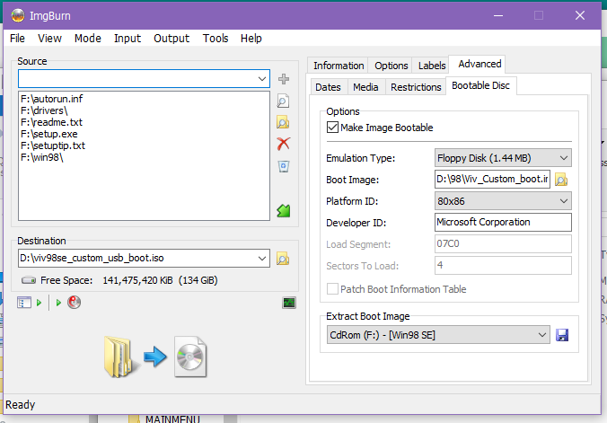

# Installing Windows 98 SE from a USB CD-ROM drive
This is the process I followed to create a bootable Win98SE media which included USB CD drivers.
I used this to install Windows on an Everex SlateVision. This tablet has a proprietary dock which adds a CD-ROM drive, and this communicates with the tablet over USB.

* Collect the tools you will need
    * ImgBurn http://www.imgburn.com/ [mirror](Setup_ImgBurn_2.5.8.0.exe)
    * DiskExplorer http://hp.vector.co.jp/authors/VA013937/editdisk/index_e.html [mirror](editd169e.rar)
* Mount your Windows 98 install media somehow, so Windows sees it as a disc
* Use ImgBurn in "Build" mode (use the Mode menu) to construct a minimal install disc:
    * Copy these files:
        * everything in the root of the win98 disc
        * the "drivers" and "win98" folders from the win98 disc
    * In Advanced > Bootable Disc:
        * Extract the Boot Image from your Windows 98 install media (click the Save icon after selecting the Win98SE media)
    * Inject usb_cd.sys to the boot image
        * Open the extracted boot image in DiskExplorer
        * Drag [USB_CD.SYS](USB_CD.SYS) into the root
        * Update config.sys to load USB_CD.SYS
            * A: use my copy of [CONFIG.SYS](CONFIG.SYS)
            * or B: copy CONFIG.SYS from the boot image, and add this to the [SETUP_CD] section: `device=usb_cd.sys /d:oemcd001`. Then copy your modified CONFIG.SYS back into the image
            * note: changes are saved immediately to the .img
    * Back in ImgBurn: Tick the "Make Image Bootable" box and pick your modified boot image
    * ImgBurn should look similar to this

    * Now click the button in the bottom right to create your ISO.
    * Burn the ISO and attempt to boot from it; installation should have no trouble finding the files on the CD

## Where did you get USB_CD.SYS from?
 My Everex SlateVision came with two recovery discs. There's apparently nothing on these discs except for a Norton Ghost image, but the tablet is able to boot from these into a Windows 98 environment. 
 
 I have no idea where the files for that environment are stored (not a HDD partition or anywhere on the disc I could see) so I ended up copying all the files to a USB drive while I was booted into that environment. USB_CD.SYS was one of those, needed to read the Norton Ghost image from the recovery CD.

 There are other USB CD drivers for DOS on the internet, and if this one didn't work for you then maybe those will. 

## Why are you installing Windows 98 on an Everex SlateVision
it looked fun